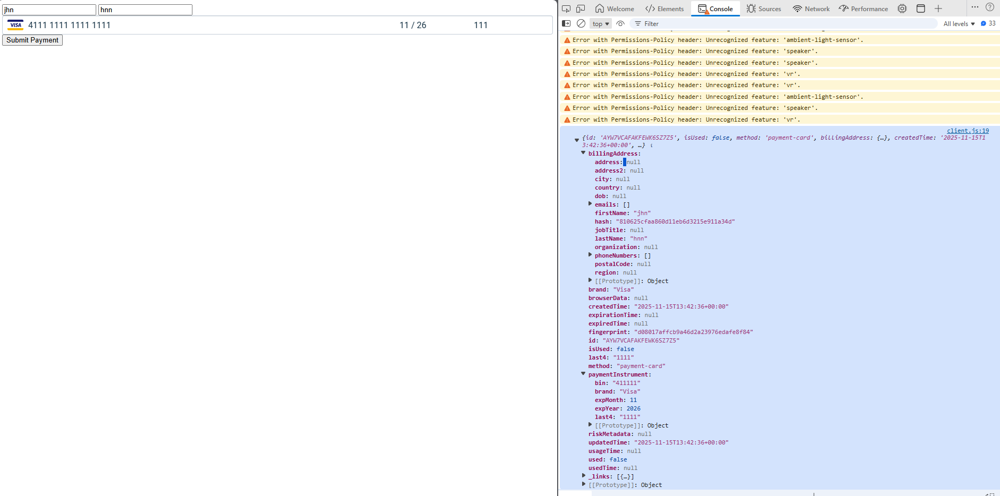

# Purpose

This repository demonstrates three key points:

1. **HPF usage in sandbox environments does _not_ require TLS or publicly exposed domains**, confirming that tunneling is unnecessary for testing and development.
2. **With clear documentation and practical examples, implementing HPF can be straightforward and developer-friendly**, even in minimal setups.
3. Get it working the the most **lazy** way possible (**no code written or investigations**)

---

# 📄 Agent Execution Summary

| **Field**           | **Value**                                                                                                                                                                                          |
| ------------------- | -------------------------------------------------------------------------------------------------------------------------------------------------------------------------------------------------- |
| **Agent**           | Cursor `composer-1`                                                                                                                                                                                |
| **Download Sample** | [https://www.rebilly.com/docs/dev-docs/setup-payment-card-method?\_\_step=include-framepay-script](https://www.rebilly.com/docs/dev-docs/setup-payment-card-method?__step=include-framepay-script) |
| **Prompts Taken**   | **3**                                                                                                                                                                                              |
| **Total Tokens**    | **112.9k**                                                                                                                                                                                         |
| **Total Cost**      | **$0.028225** (112.9k / 1M × $0.25)                                                                                                                                                                |
| **Time Taken**      | Less than 10 minutes                                                                                                                                                                               |

---

# 🧩 Prompt 1 — Create Express Server

| **Field**    | **Value**                                                                               |
| ------------ | --------------------------------------------------------------------------------------- |
| **Prompt**   | *Create a simple express.js server that can mount and serve example.html and client.js* |
| **Tokens**   | **29.8k**                                                                               |
| **Time Run** | Nov 15, 01:34 PM                                                                        |


## ✅ Outcome

The agent reviewed existing files and created the necessary Express.js setup.

### 🔧 Tools Used

`[3 tools called]`

### 📦 Files Created

| File             | Purpose                                              |
| ---------------- | ---------------------------------------------------- |
| **package.json** | Defines project metadata and Express dependency      |
| **server.js**    | Serves static files and mounts `example.html` on `/` |

### 🚀 How It Works

- Serves static files, including `client.js`
- Loads `example.html` at `http://localhost:3000`
- Listens on port **3000** (or `process.env.PORT`)

### ▶️ How to Run

```bash
npm install
npm start
```

---

# ⚠️ Prompt 2 — Fix "await is only valid in async functions…"

| **Field**    | **Value**                                                                                          |
| ------------ | -------------------------------------------------------------------------------------------------- |
| **Prompt**   | *Uncaught SyntaxError: await is only valid in async functions and the top level bodies of modules* |
| **Tokens**   | **38.5k**                                                                                          |
| **Time Run** | Nov 15, 01:37 PM                                                                                   |


## ✅ Outcome

The top-level `await` in `client.js` was invalid because the script was not a module.

### 🔧 Tools Used

`[2 tools called]` → `[3 tools called]`

## ✔️ Fixes Applied

1. **Added `type="module"`** to the script tag.
2. **Wrapped top-level `await`** inside an async function.
3. **Updated behavior** so token creation happens on form submit, not on page load.

Result: Syntax error resolved and code properly structured.

---

# 🔘 Prompt 3 — Add Submit Button

| **Field**    | **Value**                         |
| ------------ | --------------------------------- |
| **Prompt**   | *add a submit button to the form* |
| **Tokens**   | **44.6k**                         |
| **Time Run** | Nov 15, 01:41 PM                  |


## ✅ Outcome

### 🔧 Tools Used

`[3 tools called]`

A **"Submit Payment"** button was added to the form.
It triggers the existing submit handler in `client.js`.

---

# 🎉 Tokenization Success Result
| **Field**    | **Value**                         |
| ------------ | --------------------------------- |
| **Time Run** | Nov 15, 01:42 PM                  |

Below is the returned successful tokenization response:

```json
{
    "id": "AYW7VCAFAKFEWK6SZ7Z5",
    "isUsed": false,
    "method": "payment-card",
    "billingAddress": {
        "country": null,
        "firstName": "jhn",
        "lastName": "hnn",
        "organization": null,
        "address": null,
        "address2": null,
        "city": null,
        "region": null,
        "postalCode": null,
        "phoneNumbers": [],
        "emails": [],
        "dob": null,
        "jobTitle": null,
        "hash": "810625cfaa860d11eb6d3215e911a34d"
    },
    "createdTime": "2025-11-15T13:42:36+00:00",
    "updatedTime": "2025-11-15T13:42:36+00:00",
    "expirationTime": null,
    "usageTime": null,
    "riskMetadata": null,
    "paymentInstrument": {
        "bin": "411111",
        "last4": "1111",
        "brand": "Visa",
        "expMonth": 11,
        "expYear": 2026
    },
    "browserData": null,
    "fingerprint": "d08017affcb9a46d2a23976edafe8f84",
    "used": false,
    "expiredTime": null,
    "usedTime": null,
    "last4": "1111",
    "brand": "Visa",
    "_links": [
        {
            "rel": "self",
            "href": "https://api-sandbox.rebilly.com/organizations/5977150c-1c97-4dd4-9860-6bb2bab070b4/tokens/AYW7VCAFAKFEWK6SZ7Z5"
        }
    ]
}
```

## 📄 Screenshot
- It has no style, but **it works**!

